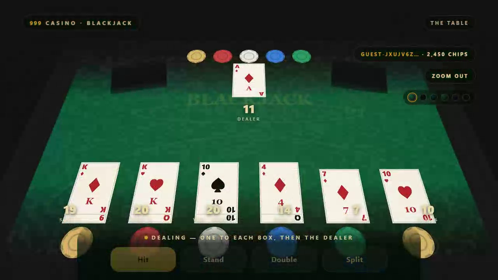
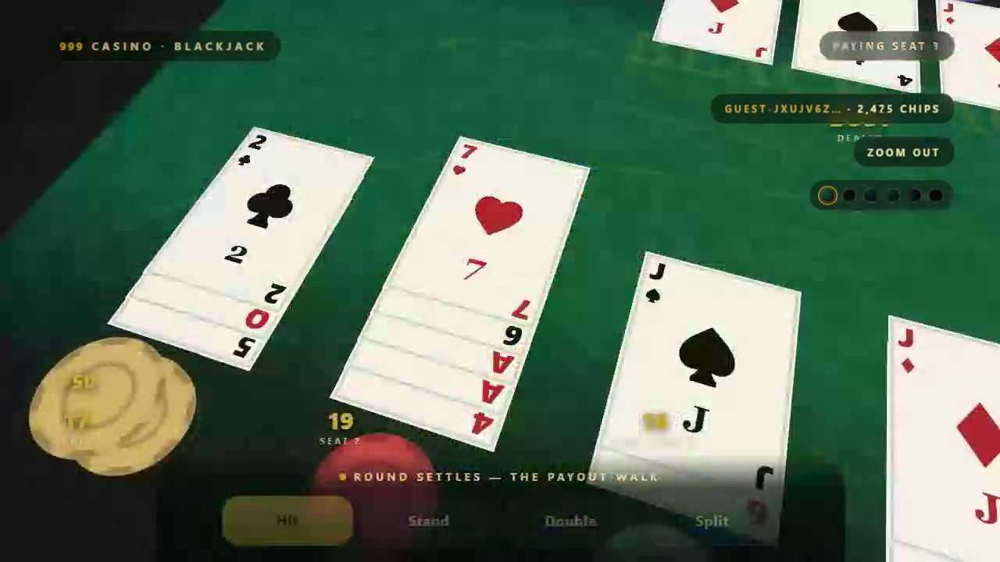

# 9993d — 999 Casino · the fullscreen 16:9 build



**The table is the screen.** One cloth, one dealer, six boxes, and a camera
that holds whoever is deciding — a full 3D blackjack table rendered live in
raw WebGL, with a fullscreen sign-in in the same presentation language.
No three.js, no CDN, no asset pipeline: every texture is drawn at runtime,
every page is self-contained, and nothing here touches the live app — these
are additive screens kept beside it for side-by-side comparison.

**▶ Play it live: https://joaoalbuq.github.io/9993d/**

**▶ Watch a round:** [deal → play → the payout walk](media/round.mp4) (≈22s)

*(workspace folder: `3dfullscreen/`)*

---

## Highlights

- **A table fitted to the frame** — a 16:9 screen gets a 16:9 frustum: the
  felt spans the viewport edge to edge, undistorted, every box in frame
  (measured at 1280×720 and 1920×1080). In a narrow portrait viewport the
  camera backs off so the whole table still fits — it widens, never crops,
  and nothing is stretched to make it fit.
- **The camera is a rule, not an interpolation** — while a box decides the
  camera **holds** that box, tight on its cards and bet; the dealer's hand
  owns the frame while it plays; a round **ends on the dealer's hand**; a
  table holding cards never parks on the wide shot. Every shot fits its
  subject (box stack, dealer fan, whole table) at any viewport — the camera
  widens, never crops.
- **Six real table cloths** — the palette set vendored verbatim from
  `999-bridge/src/theme.js`: felt, rail, accent and cloth-ink, with the two
  derived values computed by the bridge's own `shade()`. One choice paints
  the 2D felt, the 3D cloth and the HUD together, and travels in `?theme=<id>`.
- **The hub, one origin away** — `serve.js` serves the pages and proxies
  `/hub/*`, so sign-in is same-origin: no preflight, no CORS in the
  conversation at all. The signed-in **name and live wallet balance** follow
  you to the table — and the stakes are REAL: the bet (unit 25) is debited
  when the hand is dealt, a double debits one more, and settle pays the
  hand through the hub ledger. The balance tracks play.
- **Guest names are credentials** — unguessable handles (`Guest-` + 16
  random chars, ≈82 bits) replace the enumerable `Guest-NNNN` space;
  sessions verify against the hub, and existing handles are adopted from the
  legacy keys so every wallet keeps its sub.

## The screens

### `login-16x9.html` — the fullscreen sign-in

- **Fullscreen, landscape-first** — a 16:9 stage that fills a 16:9 screen
  exactly, and a compact two-column layout on phone landscape. Phones and
  tablets are landscape-only: portrait shows a rotate gate (“turn your
  phone sideways”), and the first tap in landscape enters true fullscreen —
  browser chrome hidden, the screen locked to landscape on Android; iOS
  keeps the edge-to-edge layout. Desktop keeps the letterboxed stage and
  its portrait arrangement. Safe-area insets everywhere; `visualViewport`
  keeps the panel above the mobile keyboard.
- **The felt is the screen** — procedural canvas: weave noise, light pool,
  vignette, and the printed identity (`BLACKJACK`, `DEALER MUST DRAW ALL 17`,
  `3 : 2`, `999`). Pixel ratio capped at 2; the light drift pauses when the
  tab is hidden and collapses under `prefers-reduced-motion`.
- **The hub's real client, vendored** — `makeHubClient` from
  `999-bridge/src/hub-client.js`: `session` mints, `verify` restores a warm
  session, `wallet` opens the balance. The never-throws contract is kept
  exactly — an unreachable hub degrades to a visible preview state, never a
  blank or blocked screen.

### `table-16x9.html` — the 3D table (the screen behind the login)

- **Raw WebGL, zero deps** — every texture (felt weave, card faces, backs,
  chips, the next-to-play ring) is drawn in a canvas at runtime. The table
  owns the whole viewport.
- **The readable-table rule** — each hand stacks vertically, one card of
  cloth wide, each card after the first lifting so its **top strip — where
  the rank prints — stays visible**. A ten prints **"10"**, never "T". The
  dealer keeps a sideways fan pitched a card-width apart: no coincident
  quads, no flicker. Totals print below each hand and dodge the thumb bar.
- **The full ceremony** — six boxes, a dealer hand, a shoe and a chip tray;
  European deal order (one to each box 1…6, the dealer, then a second to
  each), one card per ~0.7s, and the dealer **always plays out to 17** (S17)
  even when every box has ended. Settle is a **payout walk** (spec 4.4): the
  frame holds each box as it pays — chips fly in with the settlement's own
  `+delta` floating at the total, a losing stack flies out to the dealer —
  and the round ends back on the dealer's hand.
- **The audio ceremony (spec 4.5)** — chip clacks, card snaps and
  win/lose stingers, every sound Web Audio **synthesis** (no CDN, no
  bundled sample, no runtime download). Impact then sound: a chip clacks
  when it lands, a card snaps when it hits the cloth, and one stinger per
  round marks **your** verdict only. Gated by the 🔊 tool toggle (a mute
  that persists), and quiet behind the rotate gate and in a hidden tab.
- **Thumb action bar** — Hit / Stand / Double / Split above the safe area,
  `H`/`S`/`D` keys on desktop. The 3D zoom control's label reflects the next
  action and user zoom survives every shot change.

  

### `serve.js` — the preview host with the hub on one origin

`node serve.js` serves both pages **and proxies `/hub/*` to the dev hub**, so
the pages fetch their own origin and the browser never enters CORS — no
preflight, no `Access-Control-*` needed on any answer. The host injects
`window.__HUB_BASE__` into the pages it serves so they know the route.

### `manifest.webmanifest` + `sw.js` — the home-screen app

- **Landscape, fullscreen, installed** — the manifest locks the display to
  `orientation: landscape` and `display: fullscreen`, so the installed app
  IS the sideways 16:9 build, opening straight on the table. The icons are
  drawn at build time by `make-icons.js` — the table's own chip texture in
  logo form (gold ring, eight notches, 999 at the center), encoded as real
  PNGs by a minimal zlib encoder; `icon-512-maskable.png` scales the mark
  into the maskable safe circle.
- **An install prompt that respects the platform** — a ⤓ button (portal,
  sign-in strip, table tools) appears only when the browser fires
  `beforeinstallprompt`, and owns the prompt when it does. iOS never fires
  it — so the portal points at Share → Add to Home Screen instead, with
  `apple-touch-icon` and the `apple-mobile-web-app-*` metas covering the
  home-screen chrome.
- **`sw.js` is a pass-through** — Chrome's installability criteria still
  require a registered fetch handler, so the worker is a network-first
  shell cache that never touches `/hub/`: the ledger always goes to the
  network. Connectivity probes (`cache: 'no-store'`) are never cached and
  never rescued from cache, so the offline page can tell the line is down.
- **A branded offline state, never a dead screen** — a navigation that
  can't reach the network lands on `offline.html`: the house chip (inline
  SVG, so the brand can't 404 offline), "the floor is offline", and the
  page the player was bound for carried in `?from=`. It probes the line
  from the page, flips to **"Back online"** the moment the origin answers,
  and deals the player back into exactly the page they wanted.

## Play it

**https://joaoalbuq.github.io/9993d/** — GitHub Pages, no install: the portal
opens onto the sign-in and the 3D table. On a phone it installs as a
home-screen app — landscape, fullscreen, straight to the table. The table
is fully playable there
(deal, hit/stand/double, the camera director, all six cloths); sign-in needs
a hub, so on the public host it degrades to the visible preview state by
design.

## Quickstart (with the hub)

```bash
node poker/local-server.js    # the dev hub on :8899
node serve.js                 # pages + /hub proxy on :8787
```

Open **http://127.0.0.1:8787/** — sign in as a guest, and the wallet follows
you to the table. `?hub=<url>` points the pages anywhere; served bare (as
files or behind a static host) they fall back to the dev hub directly, which
answers with CORS headers.

## Verified

- **16:9 fit** — felt corners project inside the frame at 1280×720
  (x ∈ [3, 1277]) and 1920×1080 (x ∈ [4, 1916]); the whole table fits a
  a 390×844 portrait viewport (x ∈ [5, 385]); the HUD stage fills 16:9
  exactly. Phones and tablets in portrait now meet the rotate gate.
- **The camera director** — the full shot cycle live-sampled on the running
  page: wide table → the table → holds 1…6 → the dealer's hand → settle →
  back to the dealer.
- **Sign-in, end to end** — mint → wallet → verify restore, same-origin with
  zero preflights, and a visible preview degrade when no hub answers.
- **Real stakes through the ledger** — live-sampled rounds on the running
  page: `bj_bet` debited at the deal, a win pays `bj_prize` (stake + 1:1),
  a push returns `bj_push`, a loss keeps the stake; a double is a second
  debit. Every move carries a per-hand idempotency key — a replayed key
  returns the original result and pays nothing — and an insufficient-funds
  bet (409) leaves the hand unstaked and the pill on hub truth.
- **The felt keeps the ledger** — bet stacks are live chips, not decoration:
  a stack drops at your box the moment the `bj_bet` debit lands (nothing
  while the wallet says no), a double doubles it, and at settle the **payout
  walk** pays each box on its beat: chips arc out of the house tray to the
  winner with the settlement's own `+delta` (`+50` / `+25` / `+100` sampled
  at the totals) floating at its total, a losing stack flies to the dealer,
  and the frame returns to the dealer's hand. Sampled chip-by-chip against
  the ledger: win brings 2× the stake in, a push returns 1×, a loss sends
  the stack to the tray, and an unstaked hand moves no chips either way.
- **The audio ceremony** — live-sampled on the running page: 13 card
  snaps in the deal, chip clacks landing with the bet debits and each
  payout-walk flight, a rising triad at a won hand and a falling sigh at a
  lost one; the 🔊 toggle silences and restores it all mid-round.
- **Offline, end to end** — with the host stopped for real, an offline
  navigation lands on the branded offline state carrying the exact URL in
  `?from=` (queries included); the line probe fails honestly through the
  worker (~2s), "Try now" falls back to waiting, and when the host returns
  the page flips to **Back online** and deals the player into exactly the
  page they wanted. The ledger still passes through untouched.
- **Clean pages** — `node --check` on every inline script, no console
  errors.

## Layout

| Path | What it is |
| --- | --- |
| `index.html` | The portal entry |
| `login-16x9.html` | The fullscreen 16:9 sign-in (2D canvas felt engine) |
| `table-16x9.html` | The fullscreen 16:9 table (raw WebGL 3D engine) |
| `offline.html` | The branded offline state — "back online" returns you to the page you wanted |
| `manifest.webmanifest` | The PWA manifest — landscape fullscreen, home-screen install |
| `sw.js` | Installability service worker (network-first, `/hub/` untouched) |
| `make-icons.js` | Draws the PWA icons procedurally → `media/icon-*.png` |
| `serve.js` | Static host + same-origin `/hub` proxy (zero-dep Node) |
| `README.md` | This page |

Cloth palettes, the hub client and identity handling are vendored from
`999-bridge` (commit `5185558`) into the pages themselves — each page runs
from a single file, no imports, no build step. The cloth choice persists
under `maison21.theme` (what `maison-21/src/theme.ts` reads), with the
legacy `999.login.cloth.v1` key adopted and kept in sync.
